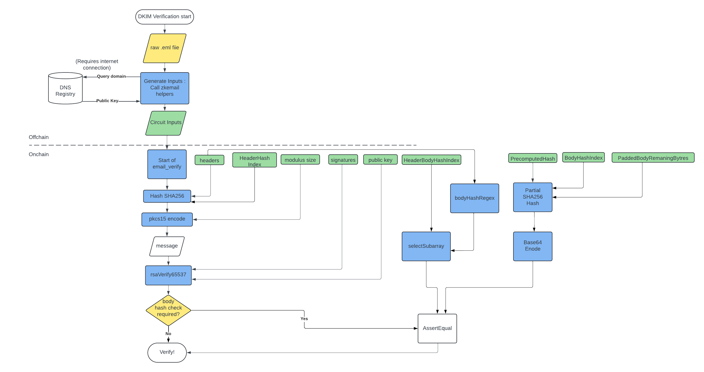

# ZK Email O1JS

Implemented using [o1js](https://github.com/o1-labs/o1js), this project is a reimplementation of [zk-email](https://github.com/zkemail/zk-email-verify), leveraging the Mina proving system [Kimchi](https://o1-labs.github.io/proof-systems/specs/kimchi.html#kimchi).

> ZK Email is an application that allows for anonymous verification of email signatures while masking specific data. It enables verification of emails to/from specific domains or subsets of domains, as well as verification based on specific text in the email body. Our core SDK comes with libraries to assist with circuit generation as well as utility templates for general zk applications.

The [zk-email-o1js]() package serves as a toolkit for zkapp developers looking to integrate email verification functionality into their o1js/Mina applications.

## Motivation

ZK Email in [o1js](https://github.com/o1-labs/o1js) serves as a o1js implementation of the existing project [zk-email-verify](https://github.com/zkemail/zk-email-verify), aimed at integrating the concept of [Programmable Provenance](https://blog.aayushg.com/zkemail/#arbitrary-length-sha256-hashing:~:text=One%20of%20the%20main,what%20zk%2Demail%20enables.) into the Mina blockchain.

> Programmable Provenance is the holy grail of web2-web3 integration, and it’s what zk-email enables.

The implementation of zk-email in o1js is a step towards achieving Mina's mission of becoming the **Proof of Everything**.

For a more in-depth understanding of the motivation and purpose behind ZK Email, please read [Aayush's thoughts](https://blog.aayushg.com/zkemail/#trustlessly-verified-identity-on-chain:~:text=The%20lack%20of,zk%2Demail%20enables.) on ZK Email.

## Primitives Overview

The ZK Email Verifier in o1js is built upon several key packages that have been developed and published to empower developers within the Mina ecosystem to build their applications.

### ZK Regex Circuit Compiler

- The ZK Regex Compiler is not a module but rather a tool that generates o1js regex circuits as strings in the terminal, which can be copied and pasted into other o1js projects.

- While not a direct dependency of the zk-email-verify project, the ZK Regex Compiler utilizes specialized regex circuits to extract the `body hash` from email headers, enabling the binding of separate inputs (header and body bytes) within the `emailVerify` circuit.

- The ZK Regex Compiler is essential for extending the utility of ZK Email verification to develop various real-world applications such as [ZKP2P](https://zkp2p.xyz/) or [Proof of Twitter](https://twitter.prove.email/). It achieves this by facilitating the extraction or validation of specific substrings from email bodies and verifying information in email headers like authority or sender details.

- For detailed usage instructions on the o1js ZK Regex Compiler, please refer to the [zk-regex-o1js](https://github.com/Shigoto-dev19/zk-regex-o1js?tab=readme-ov-file#description) documentation.

### RSA65537 Signature Verification

- This is a core primitive used by the main ZK Email Verify provable function to verify the DKIM signature of an email.

- The primitive is published as an npm package called [o1js-rsa](https://www.npmjs.com/package/o1js-rsa), making it accessible for other Mina developers to utilize.

### Base64 Encoding/Decoding

- The body hash retrieved from email headers is crucial for proving the integrity of the input body. Since the body hash in headers is base64 encoded, it's necessary to base64 encode the computed SHA256 digest of the body for a consistent and compliant integrity check.

- Initially published separately as [o1js-base64](https://www.npmjs.com/package/o1js-base64), these functionalities have been merged into the main o1js package since v1.3.0. The `base64Encode` and `base64Decode` functions can now be directly accessed as methods within the provable `Bytes` class. However, developers can refer to the package README for detailed guidance on using these primitives effectively.

### Dynamic & Partial SHA256

- Dynamic SHA256 is pivotal for verifying messages uniformly using the same verifier circuit, allowing hashing of messages up to a maximum length. This dynamic capability enhances email verification, although it imposes limits on the size of bytes in email headers and bodies. Otherwise, differing sizes would necessitate compiling distinct circuits for each email, preemptively setting the size.

- Partial SHA256 is an adaptation of dynamicSHA256. It initializes with a `precomputedHash` as the initial hash value instead of the default specified by SHA2 standards. The remaining blocks are hashed within the SNARK, mirroring dynamic hash functionality.

- Partial SHA256 serves as a significant optimization for proving the integrity of email body hashes.

- For detailed usage instructions and performance insights on dynamic & partial SHA256, please consult the [dynamic-sha256](https://www.npmjs.com/package/dynamic-sha256) package documentation.

## How to use the package

The `o1js-email-verify` includes two essential functions:

- `generateEmailVerifierInputs`: This helper function generates necessary inputs for the email verifier circuit from raw email content.
- `emailVerify`: This provable function verifies an email, optionally checking the integrity of the email body if it matches the one in the header.

### How to install

```sh
npm install o1js-email-verify
```

### How to import

```ts
import { generateEmailVerifierInputs, emailVerify } from 'o1js-email-verify';
```

### How to generate inputs for Email Verification

When generating inputs for the provable `emailVerify` function, follow these guidelines:

- Start by specifying the `filePath` of the raw EML file.
- Optionally, adjust the size limits for the headers and body:

  - `maxHeaderLength`: Default is 1024 bytes.
  - `maxRemainingBodyLength`: Default is 1536 bytes.
  - Ensure these sizes are multiples of 64 and sufficiently large to accommodate your inputs.

- The input generator returns an object that must be destructured for use with the `emailVerify` function:

  - See the [tester function example](https://github.com/mohammed7s/zk-email-o1js/blob/main/src/tester.ts#L36-L52) for guidance.

- Customize the `bodyHashCheck` boolean parameter to indicate whether to verify the body hash (`true`) or not (`false`).

- Any deviation from these input requirements may cause the email verifier circuit to fail. The `emailVerify` provable function includes robust security checks to detect and handle errors effectively.

## Using ZK Email Verification in Real-World Applications

### Existing Projects Utilizing ZK Email on Ethereum

- [ZKP2P](https://zkp2p.xyz/): Decentralized Venmo <> USDC Bridge
- [Email Wallet](https://emailwallet.org/): Send transactions via email or act as a Safe multisig signer!
- [Email Account Recovery](https://prove.email/blog/recovery): Use emails as guardians for any smart wallet or multisig.
- [Nozee](https://nozee.xyz/): Anonymous Proofs of Email Domain via JWTs
- [Proof of Twitter](https://twitter.prove.email/): Verify your Twitter username on-chain using zk proofs.

### Developing zkApps with ZK Email

Currently, there isn't a robust demo of a zkapp using the ZK Email Verification infrastructure. Here is a general approach to developing such applications:

- **Generate Inputs and Verify Email:** Follow the instructions in the [input generation guide](#how-to-generate-inputs-for-email-verification).
- **Call `emailVerify` in a zkApp Method:** Use this function to prove the authenticity of the email and its body.
- **Optional: Use ZK-Regex for Sender Authority:** Implement a zk-regex circuit to assert the authority of specific senders (e.g., Twitter, GitHub, Venmo).
- **Extract Data from Email Body:** Use a tailored zk-regex circuit to scrape specific data from the email body, such as a Twitter handle or invitation ID etc.

## Troubleshooting

Please note that the input generator function is a wrapper around the [helpers](https://github.com/zkemail/zk-email-verify/tree/5613d743773927fa4fbee1472b6aed6bde34a6cc/packages/helpers) from the zkemail library, particularly the DKIM parser class, to generate the inputs required for the email verifier circuit.

The decision to use the original zk-email library helpers for input generation ensures that we benefit from code audits and maintain compatibility with other zk-email applications in the future.

For any bugs or errors, you can refer to the [FAQ](https://zkemail.gitbook.io/zk-email/frequently-asked-questions) or open an issue in the original [zk-email-verify](https://github.com/zkemail/zk-email-verify/issues) repository.

## How to build

```sh
npm run build
```

## How to run tests

```sh
npm run test
npm run testw # watch mode
```

## How to run coverage

```sh
npm run coverage
```

## How to quickly verify an eml

Download your email EML file, change the `filePath` in the [tester file](./src/tester.ts), and run:

```sh
npm run tester
```

## How to benchmark

```sh
npm run zkProgram
```

### Preview

```sh
verifyEmailNoBodyCheck summary:  {
  'Total rows': 109111,
  Generic: 41907,
  EndoMulScalar: 30840,
  RangeCheck0: 2488,
  Xor16: 22512,
  Zero: 11265,
  Poseidon: 99
}

verifyEmailBodyCheck1024 summary:  {
  'Total rows': 340298,
  Generic: 206040,
  EndoMulScalar: 64102,
  RangeCheck0: 2488,
  Xor16: 45040,
  Zero: 22529,
  Poseidon: 99
}

verifyEmailBodyCheck1536 summary:  {
  'Total rows': 386506,
  Generic: 221528,
  EndoMulScalar: 77926,
  RangeCheck0: 2488,
  Xor16: 56304,
  Zero: 28161,
  Poseidon: 99
}
```

### Comparison of Email Verifier Circuit

| **Function**          | **O1JS Kimchi Constraints**               | **Circom R1CS Constraints**               |
| --------------------- | ----------------------------------------- | ----------------------------------------- |
| SHA256 header hashing | 92,675 constraints for a 1024-byte input  | 506,670 constraints for a 1024-byte input |
| RSA65537              | 12,401 constraints                        | 149,251 constraints                       |
| SHA256 body hashing   | 139,074 rows for a 1536-byte input        | 760,142 rows for a 1536-byte input        |
| base64Encode          | 1,697 constraints for a 32-byte input     | 1,697 constraints for a 32-byte input     |
| bodyHashRegex         | 86,453 rows for a 1024-byte input         | 617,597 rows for a 1024-byte input        |
|                       | 145,586 rows if selectSubarray is counted |                                           |

## Further Development Directions

- Compute and integrate domain check regex function.
- Ensure RFC compliance for the email verification standard for DKIM.
- Develop a universal DKIM registry for the Mina ecosystem with an incentivized oracle network of DNS servers.
- Explore handling very large emails using kimchi's recursion capabilities.
- Experiment with wallet integrations.


## Verifying DKIM Signatures 

DKIM (DomainKeys Identified Mail) signatures became a standard [RFC6376](https://datatracker.ietf.org/doc/html/rfc6376) in 2011 to provide authenticity to emails and protect against phishing and other fraud attempts. Most emails today are signed by the domain that sent it using a public key signature (a public and private key pair) like [RSA](https://cryptobook.nakov.com/digital-signatures/rsa-signatures). The standard specifies which parts of the emails are signed and how data is formatted. 


An example of dkim signature found in the header of an email:

```
DKIM-Signature: v=1; a=rsa-sha256; c=relaxed/relaxed; d=androidloves.me;
	s=2019022801; t=1584218937;
	h=from:from:reply-to:subject:subject:date:date:message-id:message-id:
	 to:to:cc:content-type:content-type:
	 content-transfer-encoding:content-transfer-encoding;
	bh=aeLbTnlUQQv2UFEWKHeiL5Q0NjOwj4ktNSInk8rN/P0=;
	b=eJPHovlwH6mU2kj8rEYF2us6TJwQg0/T7NbJ6A1zHNbVJ5UJjyMOfn+tN3R/oSsBcSDsHT
	xGysZJIRPeXEEcAOPNqUV4PcybFf/5cQDVpKZtY7kj/SdapzeFKCPT+uTYGQp1VMUtWfc1
	SddyAZSw8lHcvkTqWhJKrCU0EoVAsik=
```

v: version of the DKIM key record
a: The algorithm used for hashing (sha256) and signing (RSA)  
c: message canocicalization: how is message formatted before signing  
d: domain used for the DNS lookup  
s: Selector for the public key  
t: signature timestamp  
h: header fields used as message in signature  
bh: body hash of body in base64 encoded    
b: base64 encoded signature  

Presented with a signature above, we can verify it using these steps:

1. Check the signature algorithm and get the public Key for the domain from a DNS server: query any DNS server to obtain the public key of a domain using s and d. It returns a p value for public key that looks like this:

```
"v=DKIM1; k=rsa; p=MIGfMA0GCSqGSIb3DQEBAQUAA4GNADCBiQKBgQCcaywJn59dbp7TbRiDsVloBdCsgl9wAEvHo9WCDSNRqDJjkF1Fjy44Q4emckHP/Tv7hJdIlBtV8hEw5zGD+/kKkhnlx04BSYqXuxed1nOq6FDjNTIR6TmHetMfVU1IcO7ewyJZp5/2uM64JmTDh2u3ed4+JR7jqFE2e/ZqBTM1iQIDAQAB"
```
2. Construct the exact header message that is signed. Exact header format is specified in the parameter h. 
3. Hash the header message from 2. 
4. Format using pkcs1.5 encoding [see here](https://datatracker.ietf.org/doc/html/rfc3447#section-9.2)
5. verify the rsa signature using the signature b, public key p and the hashed header obtained from step 4. Note: We know its RSA signing algorithm because of a. 

Another check that is usually performed as an extra measure is the body hash check which is field bh in the header that should correspond to the body b. To perform this check: 
6. Calculate the hash of the body from b 
7. compare the hash with the base64 decoded value bh from the DKIM-signature header of the email 



## Acknowledgments

- Thanks to the zk-email team for their pioneering efforts, comprehensive library, detailed documentation, and quick responses to our questions on the Telegram group.
- Gratitude to the Mina Foundation for funding the zkIgnite series.

## License

[Apache-2.0](LICENSE)
