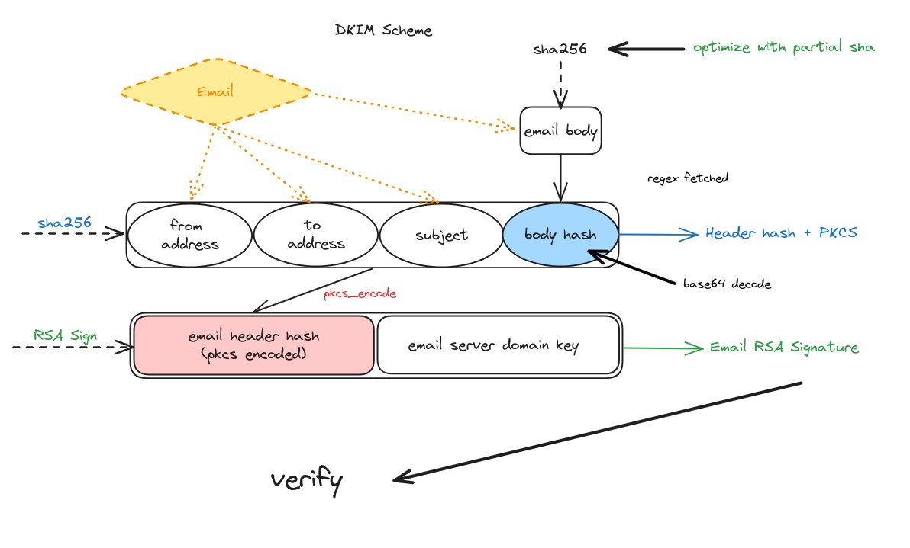

# Zk Email O1js

ZK Email is an o1js library that can be used to verify authenticity of email signatures from specific domains in addition to verifying the specific text of the email body within a mina smart contract. 

## About ZK Email o1js 

This project is an o1js implementation using the Mina proving system kimchi of the circom based zk-email [library](https://github.com/zkemail/zk-email-verify). Strongly recommend reading the following resources about the project: 
* https://zkemail.gitbook.io/zk-email/
* https://blog.aayushg.com/zkemail/
* https://github.com/zkemail

### How to build

```sh
npm run build
```

### How to run 

To run with any email, download raw email file (.eml) and place in /eml folder
change `email.eml` to required email file in this line in main.ts `const filePath = path.join(__dirname, '../../eml/email.eml');`

### How to run tests

```sh
npm run test
npm run testw # watch mode
```

### How to run coverage

```sh
npm run coverage

```

### FAQs

1. `Error: DKIM signature verification failed for domain androidloves.me. Reason: DNS failure: ESERVFAIL`
This is an internet issue. try a different internet connection or disable vpn if enabled. 

## License

[Apache-2.0](LICENSE)


## How ZK Email works 

Most emails today are signed by the domain that sent it using a public key infrastructure (a public and private key pairs) like RSA. The domain to public key mapping is kept in the public DNS registry. Email mailboxes use this to verify the identity of email senders to detect phishing and scam attempts and that the original message has not been tampered with in transit. 

These signatures are known as DKIM (DomainKeys Identified Mail) signatures.The standard for DKIM signatures is formalized in an internet standard [RFC 6337](https://datatracker.ietf.org/doc/html/rfc6376). This standard is maintained by the IETF (a non profit since 1993). The signature scheme used is RSA. The standard specifies which parts of the emails are signed and how data is formatted. 

An example of dkim signature found in the header of an email: 

```
DKIM-Signature: v=1; a=rsa-sha256; c=relaxed/relaxed; d=androidloves.me;
	s=2019022801; t=1584218937;
	h=from:from:reply-to:subject:subject:date:date:message-id:message-id:
	 to:to:cc:content-type:content-type:
	 content-transfer-encoding:content-transfer-encoding;
	bh=aeLbTnlUQQv2UFEWKHeiL5Q0NjOwj4ktNSInk8rN/P0=;
	b=eJPHovlwH6mU2kj8rEYF2us6TJwQg0/T7NbJ6A1zHNbVJ5UJjyMOfn+tN3R/oSsBcSDsHT
	xGysZJIRPeXEEcAOPNqUV4PcybFf/5cQDVpKZtY7kj/SdapzeFKCPT+uTYGQp1VMUtWfc1
	SddyAZSw8lHcvkTqWhJKrCU0EoVAsik=
```

a: The signing algorithm used
c: the format
d: domain 
s: 
t: 
h: 
bh: 
b: 

To verify a DKIM signature we follow these steps: 

1) query the DNS server to obtain the public key of a domain using s and d. It returns a p value for public key that looks like this: 
```
"v=DKIM1; k=rsa; p=MIGfMA0GCSqGSIb3DQEBAQUAA4GNADCBiQKBgQCcaywJn59dbp7TbRiDsVloBdCsgl9wAEvHo9WCDSNRqDJjkF1Fjy44Q4emckHP/Tv7hJdIlBtV8hEw5zGD+/kKkhnlx04BSYqXuxed1nOq6FDjNTIR6TmHetMfVU1IcO7ewyJZp5/2uM64JmTDh2u3ed4+JR7jqFE2e/ZqBTM1iQIDAQAB"
```
2) determine the header which is the message that is signed based which is given by the parameter h 
3) hash the header 
4) format using pkcs1.5 
5) verify the RSA signature using the signature s, public key p and the hashed header obtained from previous step. 

To also check the body hash: 
6) calculate the hash of the body from b 
7) compare the hash with the base64 decoded value bh from the DKIM-signature header of the email

These steps are summarized in the following diagram: 



TODO: explain how the Regex works and how its used along the DKIM signature to verify specific parts of the body


## Implementation details 

* We utilize the offchain [helpers]() from the zkemail library, particularly the DKIM parser class to generate the inputs that would go in the circuit. This is implemented in the `generate-inputs.ts` file. 

* 