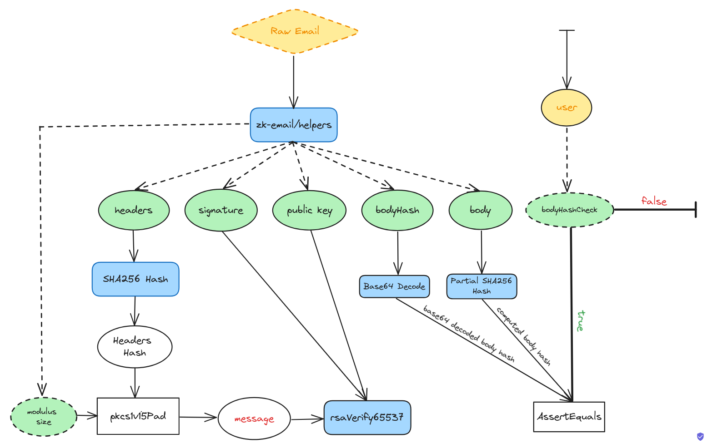

# Zk Email o1js

ZK Email is an o1js library that allows for verification of email DKIM signatures and selective text from
the body of a sent or received email. The library also acts as a toolkit for the app developer who wishes to incorporate email verification functionality in their o1js/Mina applications.

This project is an o1js implementation of [zk-email](https://github.com/zkemail/zk-email-verify). o1js uses the Mina proving system [Kimchi- inser link]() for its circuits and offers an alternative implementation to circom and halo2 based implementations. 

Moreover, since the whole execution environment is a zk circuit, o1js allows for writing write smart contracts and other circuit logic in one language. 


## Quickstart 

#### To quickly check validity of an eml file 

1. Place raw email (.eml) file in /eml folder 
2. Modify the VARIABLE of the file in eml-check.ts

```
const filePath = path.join(__dirname, '../../eml/email.eml');
```

3. Build and run

```sh
npm run build && node build/src/main.js 

```
This will process the .eml file, and generate inputs for the circuit, then calls the `verify_email` function to validate the inputs in o1js environment.  

#### To use as toolkit for developing an o1js application with email verification functionality

 follow these steps: 

1. Generate the Regex circuit 
2. Write the smart contract logic
3. Generate circuit inputs from raw eml file (frontend)

A more thorough guide on developing an application is in this file along with a tutorial. 


#### To run tests & coverage

```sh
npm run test
npm run testw # watch mode

```
```sh
npm run coverage

```


#### To run benchmarks 


## Library guide 

/`email-verify.ts`   
contains the core functionality of the library. It verifies a DKIM signature using the provided message, signature, and public key. It also checks the body hash if it matches the one in the header. 

The input can take bodyHashCheck = true or false 

At its core, it verifies the signature using RSA siganture. The RSAVerify
represents the 


/`generate-inputs.ts`  
contains the preprocessing of the raw email file (.eml) 
Purpose: used in an application's frontend to handle the eml file. 

/`zkapp.ts`  
e2e example of a twitter handle verification in smart contract. Use this as a template or reference for an application implementation. 

/`main.ts`  
change name to `eml-check.ts`
Purpose: This file can be used is a basic function test for an eml file. 

/`utils.ts`  
Purpose: has a bunch of supporting utils for functionality of the library. 


## Dependencies 

#### zk-email helpers  
We utilize the offchain [helpers](https://github.com/zkemail/zk-email-verify/tree/5613d743773927fa4fbee1472b6aed6bde34a6cc/packages/helpers) from the zkemail library, particularly the DKIM parser class to generate the inputs that would go in the circuit. This is implemented in the `generate-inputs.ts` file. The choice to use the original zk email library helpers to generate inputs is that we can benefit from code audits and better compatibility with other zk-email apps in the future.

#### zk-regex-o1js

#### RSA-o1js

#### Base64-o1js    

Comment about: Dynamic and updateable SHA


## [How ZK Email Works](/docs/how_zkemail_works.md)


## References  

- https://zkemail.gitbook.io/zk-email/
- https://blog.aayushg.com/zkemail/
- https://github.com/zkemail

## Benchmark 

## Contribution 

How to contribute:
-submit issues 
-submit PRs 

Regex standards for different emails. We would like to keep email library of Regex's. 


## Acknowledgment
zk-email team who led the way and ventured and provided a well documented library, and documentation, and who were quick and responsive to answer our questions on the telegram group. 

Mina foundation for funding the zkignite series 
zkignite participants who have helped like Rahul, Lauri, 


o1js labs (gregor, florian, and others) for mentorship and guidance 


## Known problems 

- Hotmail and protonmail not working 


## Further development // directions 

- Compute and add domain check regex function
- RFC compliance of the email verify standard for DKIM. 
- develop a universal DKIM registry for the Mina ecosystem with incentivized oracle network of DNS servers.
- Handling very large emails: kimchi is ideal for recursion and would be cool to experiment with very large emails.   


## Feedback
email  
telegram  
form   
submit an issue 


## Support 

The project is a public good project. 

Mina multisig address: 

The funds will be used for the development of the following milestones


## License

[Apache-2.0](LICENSE)


### FAQs

1. What is zkemail exactly? Its the technique of 
2. `Error: DKIM signature verification failed for domain androidloves.me. Reason: DNS failure: ESERVFAIL`
   This is an internet issue. try a different internet connection or disable vpn if enabled.


These steps are summarized in the following diagram:




