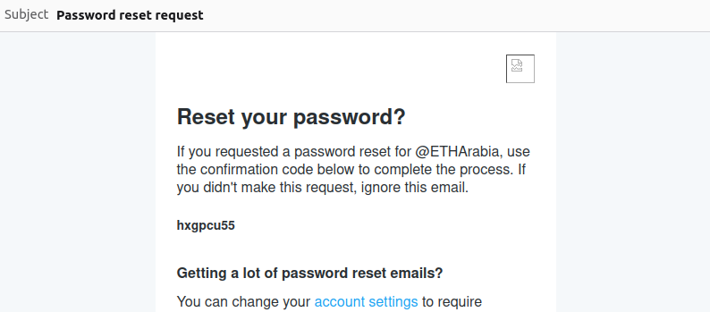

# How to use zkemail-o1js 

The zkemail-o1js library is a toolkit for the app developer who wishes to incorporate email verification functionality in their o1js applications. In order to verify information from an email, the developer would need to do the following steps: 

1. Generate the Regex circuit 
2. Write the smart contract logic
3. incorporate circuit inputs from raw eml file (frontend)

We will go into each step in detail and attempt to walkthrough a simple twitter handle verification example. 


### Installation 

```
npm install zk-email-o1js
```

[any comments here?]


### Generate the regex circuit

An app developer must specify initially what they wish to get from the email. Which data is being verified. And also exactly how it appears in the email (eg. which characters comes always before or after the information being verified). For example in the twitter example, this is what an email looks like: 



We could for example restrict it to reveal what comes immediatley after "password reset for @" in order to capture the user's username.  

The fucntionality of restricting to specific sequence of characters comes from the zk-regex library. Regex stands for [Regular Experession](https://en.wikipedia.org/wiki/Regular_expression )and is an old technique in computer science to match specific text within a larger body. Its ideal for use in a zk circuit setting and is considered (to out knowledge) the most efficient way to match text in a circuit. 

To learn more about it, and how it works, I urge you to go through the README.md of the repository which contains explanations and resources. However if you do not wish to read more, the only thing you should know is that regex has its own syntax to speficiy the target text we are looking for, so for example in our twitter example the regex syntax looks like this: 

`password resets for @[A-Za-z0-9]+'

This is the only thing an app developer must figure out: how does their target text looks like in regex syntax. This is also called the regex pattern. 

This resource will help you if you are starting from scratch. Though chatGPT and similar ai tools seem to do a decent job at specifying, you can (and maybe should always) confirm by checking the graphs in this [kregex tool](https://zkregex.com/min_dfa). 

Once you have a target regex pattern you can simply: 

clone the zk-regex repo:

``` 
git clone git@github.com:Shigoto-dev19/zk-regex-o1js.git
cd zk-regex-o1js 
npm run zk-regex 'password resets for @[A-Za-z0-9]+' '[A-Za-z0-9]+' 

```
The command will auto-generate the o1js code that will check the text for the desired app-specific pattern, it will log it in terminal and will look like this example https://github.com/Shigoto-dev19/zk-regex-o1js/blob/main/images/alpha-low-zk-regex.png

we will wrap this logic in a function so we can use it in our app:

```
function twitterInputRegex(input: UInt8[]) {
    <insert generated circuit code here> 
}

```

Note: This function can be pasted in the same file where the smart contract logic is or in a seperate file that is imported. You will notice some general regex functions used in the email verification are already generated and included in the utils.ts file. This is because we use regex library to also validate some information about the signed headers. (Read here if you wish to understand how zkemail signatures verifcation works under the hood)


### Write the smart contract logic

1. Managing and verifying the public key hash 

Most applications will want to verify the public key spefified in the email dkim signature in fact corresponds to the application speific domain (in our case x.com public key). This ensures that the user (prover) doesnt try to pass a valid dkim signature but for a different unrelated domain. The hash of the public key is used instead of the actual public key because the hash gives us a constant size and is more efficient to store. 

How this verification occurs in smart contract is left to the app developer to decide. These are some available options:

1. Hardcode the public key hash as a state variable in smart contract (downside: DNS records rotate often and might not be practical to upgrade the smart contracts regularly just to update the public key) 
2. Setup a dkim registry smart contract that can be updated by permissioned parties (downside who are these permissioned parties?)
3. Create a generic dns oracle for Mina zkemail apps to use (most principled but someone should do it) 

Note: Public DNS registries are decentralied in nature, and many entities run their own versions. So there are synergies between them and public blockchains like Mina.  

In our example, we will hardcode it by storing the public key hash of x.com at time of committing this file as a state variable in our smart contract. If you query any DNS server you will get this as their public key: 

If you Poseidon hash it, it looks like ths: 


We can store this as a state variable in the smart contract like this: 


Once we have decided how to store it we can verify it in our verification method in our smart contract. Our method for verifying the twitter handle is called `verify_handle` and looks like this including the public key hash check:

```
@method async verify_handle(
    headers: HeadersBytes,
    signature: Bigint2048,
    publicKey: Bigint2048,
    bodyHashIndex: Field,
    body: BodyBytes
  ) {
    // check public key has matches the stored: 
    const currentTwitterPublicKeyHash = await this.TwitterPublicKeyHash.get();
    this.TwitterPublicKeyHash.requireEquals(this.TwitterPublicKeyHash.get());
    const publickeyhash = Hash.Poseidon.hash(publicKey.fields); 
    publickeyhash.assertEquals(currentTwitterPublicKeyHash);

}
```


2. Check the DKIM signature  

Once we are sure we are using the public key registered, we can validate the signature. In most cases the signature scheme used is RSA but could be different or the standard updated in the future. This implementation only supports RSA. To do this simply include this line in the verfify_handle method: 

```
  // email verify email signature with body hash check
  emailVerify(
    headers,
    signature,
    publicKey,
    2048,
    true,
    bodyHashIndex,
    body
  );
```

The email verify function is the heart of the zkemail library and includes the logic for RSA. 

The only thing an app developer must decide is if they want to check the body hash matches the bh value in the header or not. This is spefied in input 5 of the function. (insert permalink here to exact input line)
if true, 
if not, 
why would you want to check vs not


3. Check the regex pattern 

This is where the output of the zk-regex command comes in. We would like to verify the exact regex pattern 

In our example we put the logic in a function like this in the same zkapp.ts file: 

```
function twitterInputRegex(input: UInt8[]) {
  const num_bytes = input.length;
  let states: Bool[][] = Array.from({ length: num_bytes + 1 }, () => []);
  let state_changed: Bool[] = Array.from({ length: num_bytes }, () => Bool(false));

  states[0][0] = Bool(true);
  for (let i = 1; i < 22; i++) {
          states[0][i] = Bool(false);
  }
  // ...

```

we then include it in the `verify_handle` method like this: 

```
placeholder

```

Our smart contract logic is now complete. We have a state variable representing the public key hash to compare against, and also have a `verify_handle` smart contract method we can call from a mina transaction. Next step we need to create the frontend for the user and what exactly shoule we process the eml files. 


## step3: Generate inputs 

You might be wondering why dont we simply feed the whole eml file as in input to the smart contract. That would be the most principled thing to do. 
In particular that o1js apps generate proofs on the client side so who cares if the eml file is too long since its all processed on the client side anyways. So why do we need to process it? 

- we need to retrieve the public key from a DNS registry for a given domain. This is not included anywhere in the raw email text (.eml file)
- we need to have the data in a provable format. Its easier if we process it offchain rather than deal with these conversions onchain from a string (the string would be the way the smart contract would capture it).  
- it will take less time for the prover to do it offchain. 

Are there any effects on security? The answer is no. Because: 

- 
- 

So how to prepare the eml file for the onchain transaction? 

1. Download the eml file 

The user will have to download the .eml file based on what email clients they are using. This has nothing to do with the app developer. However, with gmail its straightforward. 


2. Generate inputs 

Note that the generate inputs function is a wrapper for the helpers of the zkemail library. We have decided to use those helpers because their code is audited and we do not need to recreate the work from scratch for our application. However the o1js wrapper does a few extra things like converting to the rerquired o1js data types.  

Note: this preprocessing of the input will happen on the user side that is interacting with the app. As an app developer you might want to incorporate these functionality on the frontend for the user. 


```
import { generateInputs } from './generate-inputs.js';

const inputs = await generateInputs(rawEmail); 
```

The transaction can then be called like this: 

```
const txn1 = await Mina.transaction(deployerAccount, async () => {
  await zkAppInstance.verify_handle(
      inputs.headers,
      inputs.signature, 
      inputs.publicKey,
      inputs.bodyHashIndex,
      inputs.body
  );
});


